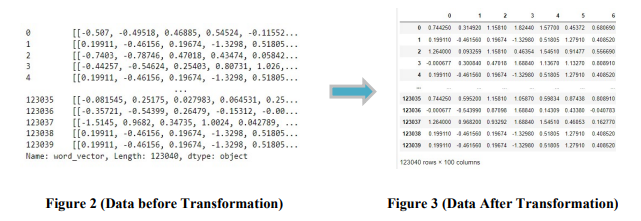

# Network-Intrusion-Detection
The goal of the project is to develop a model to detect network intrusion by using machine learning algorithms 
Table of Contents

➤ OverView

➤ DataSet

➤ Getting Started

☁️ Overview

we develop different models and evaluate them by accuracy and recall to not miss any malicious, so we focus on high recall of class 1. After evaluation, the best five models are SVM, Random Forest, Logistic Regression, Decision Tree, and MLP. The following step is to build the Stacking algorithm and voting algorithm with hyperparameter and without the hyperparameter. The champion model was a stacking algorithm (Random Forest, Decision Tree, SVM) with default parameters that Accuracy equals 80% and recall of 84%.

🔸 DataSet

Our dataset is the KISTI+IDS2021-CDMC data, which includes 153,829 IDS alerts labeled as either malicious (label: 1) or benign (label: 2). The data is divided into two parts: training data with labels and testing data without labels. Data includes a word vector column where every row consists of unbalanced number of nested list and each list is 1*100 dimensions. For instance, the first row contains 19 nested lists, but second row has 25. That needs to be converted from many nested lists to a single (1 x 100) feature by selecting the maximum value from the nested lists inside each row, representing the most important word.

📖 Getting Started

Preprocessing :

1- Transformation of data:by selecting the maximum value fromthe nested lists inside each row, representing the most important word.

2- Normalization :using the Minmax Scaler from Sklearn.

image

3-Cross Validation : K=5

⚙️ Methodolgy

1- Classification Model

 - SVM
 
 -Gaussian Naive Bayes
 
 - Isolation Forest
 
 - Decision Tree
 
 - Logistic Regression
 
 - Multi-layer Perceptron classifier
2- Ensemble Model

-Random Forest

-AdaBoost

-Stacking Algorithm

-Voting Algorithm
3- Hyperparamter Tuning : on the best five modelwas SVM, Random Forest , Decision Tree, MLP and logistic Regression

image

4- Performance Evaluations: by Accuracy , Recall and F1 Score

📜 Result

image

Stacking and voting result before hyparameter tuning
image

Stacking and voting result AfterS hyparameter tuning
image

The Champion Model was stacking algorithm with default paramters
